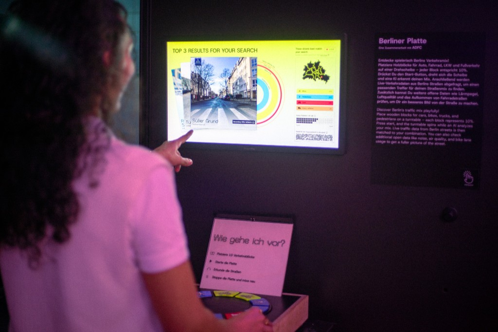
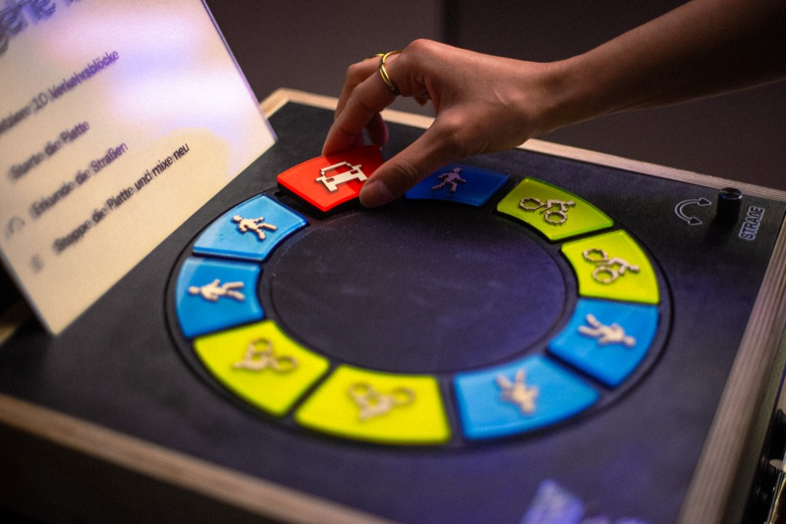

<!-- ALL-CONTRIBUTORS-BADGE:START - Do not remove or modify this section -->

[](#contributors-)

<!-- ALL-CONTRIBUTORS-BADGE:END -->

# Berliner Platte

**Berliner Platte** is an interactive exhibit that lets visitors explore Berlin's traffic mix by arranging physical blocks on a rotating disk. A Raspberry Pi camera uses YOLO object detection to read the composition of cars, bikes, pedestrians, and heavy vehicles, then matches it against live [Telraam](https://telraam.net/) sensor data to surface the three closest real Berlin streets — complete with street imagery, air quality, noise levels, and bike-lane infrastructure. The exhibit was developed based on the Telraam data collected by the [ADFC](https://www.adfc.de/) and is built as a monorepo with a React frontend, Node.js/WebSocket backend, and Python scripts for hardware control on a Raspberry Pi.

<p align="center">
  
  
</p>

## Table of Contents

- [📁 Project Structure](#project-structure)
- [⚙️ Physical Computing](#physical-computing)
- [📦 Installation](#installation)
- [🚀 Usage or Deployment](#usage-or-deployment)
- [💻 Development](#development)
- [📊 Data Processing](#data-processing)
- [🔁 Autostart Setup](#autostart-setup)
- [🤝 Contributing](#contributing)
- [👥 Contributors](#contributors-)
- [📜 Content Licensing](#content-licensing)
- [🙏 Credits](#credits)

## **Project Structure**

```
traffic-exhibit/
├── apps/
│   ├── web-app/       # React + Vite + TypeScript frontend
│   └── api/           # Node.js + WebSocket backend + Python scripts
├── package.json       # Root package.json for npm workspaces
└── README.md
```

## Physical Computing

The exhibit's tangible interface is powered by a **Raspberry Pi 5** running the software stack alongside dedicated Python scripts for GPIO, camera, and motor control.

### Hardware

| Component                             | Role                                                                            |
| ------------------------------------- | ------------------------------------------------------------------------------- |
| **Raspberry Pi 5**                    | Runs the frontend, backend, YOLO detection, and GPIO scripts                    |
| **Raspberry Pi Camera Module (Wide)** | Captures the traffic blocks on the disk for real-time object detection          |
| **DRV8825 stepper motor driver**      | Drives the stepper motor with microstepping for smooth, quiet rotation          |
| **NEMA 17 stepper motor (20 mm)**     | Rotates the traffic-block disk via a lazy Susan bearing                         |
| **Lazy Susan bearing**                | Supports the rotating disk that visitors arrange blocks on                      |
| **Toggle switch**                     | Starts and stops the disk rotation (each flip toggles the exhibit on/off)       |
| **Rotary switch (encoder)**           | Cycles through matched street results; pressing the switch confirms a selection |

### How it works

1. **Arrange blocks** — Visitors place up to ten coloured traffic blocks (cars, bikes, pedestrians, heavy vehicles) on the rotating disk.
2. **Start the plate** — Flipping the toggle switch starts the stepper motor, which spins the disk for up to four minutes (or until toggled off again).
3. **Detect the mix** — The wide-angle Pi camera feeds frames to a YOLO model (`apps/api/scripts/yolo_detect.py`), which classifies the modal split and sends counts to the backend via WebSocket.
4. **Match streets** — The backend compares the detected composition against enriched Telraam data and returns the three closest Berlin streets.
5. **Explore results** — Turning the rotary switch cycles through the top matches on screen; pushing it triggers the street-view transition.

GPIO input and motor control are handled by `apps/api/scripts/button_monitor.py`, which communicates with the Node.js backend over Socket.IO. Standalone test scripts for individual components are available in `apps/api/scripts/` (`test_motor.py`, `test_toggle_switch.py`, `test_rotary_encoder.py`).

## Installation

### **1. Install Node.js Dependencies**

Run the following command in the **root directory** to install dependencies for all workspaces:

```bash
npm install
```

### **2. Set Up Python Virtual Environment**

The project uses Python scripts for hardware interaction (button monitoring and motor control). Set up a virtual environment in the `apps/api` directory:

```bash
cd apps/api
python3 -m venv venv
source venv/bin/activate
pip install -r requirements.txt
```

**Note**: Remember to activate the virtual environment whenever you work with Python scripts:

```bash
source apps/api/venv/bin/activate
```

## Usage or Deployment

### **1. Start All Processes (recommended)**

To start the full stack in one go (data processing, dev server, hourly processing, YOLO detection, button monitor, and open the app in the browser):

```bash
npm run start-all
```

This runs the `start_all.sh` script, which:

1. Runs initial data processing (`process-data`)
2. Starts the dev server (frontend + backend)
3. Starts hourly data processing in the background
4. Starts YOLO detection
5. Starts the button monitor (foreground; Ctrl+C stops it)
6. Opens the app in the browser (normal window, not kiosk)

Options (environment variables):

- `OPEN_BROWSER=0` — do not open the browser
- `PROJECT_DIR=/path/to/traffic-exhibit` — override project directory
- `APP_URL=http://localhost:5173` — override app URL

You can also run the script directly: `./start_all.sh`

### **2. Run the Project Locally (manual)**

In the **root directory**, start both the frontend and backend:

```bash
npm run dev
```

**Additionally**, in a separate terminal, navigate to `apps/api` and start the button monitor:

```bash
cd apps/api
npm run start-button-monitor
```

- The frontend will be available at: [http://localhost:5173](http://localhost:5173)
- The backend WebSocket server will run on: [http://localhost:3001](http://localhost:3001)
- The Python button monitor will be running in the background

### **3. Access the Application**

Open your browser and navigate to:

```
http://localhost:5173
```

## Development

### **1. Frontend Development**

- The frontend is built with **React**, **Vite**, and **TypeScript**.
- WebSocket communication is handled via `socket.io-client`.
- Edit files in `apps/web-app/src/` and save to see changes reflected in the browser.

### **2. Backend Development**

- The backend uses **Node.js**, **Express**, and **WebSocket** (`socket.io`).
- Python scripts are called using Node.js' `child_process`.
- Edit files in `apps/api/src/` and restart the backend to see changes.

### **3. Python Integration**

- Python scripts for camera and motor control are located in `apps/api/scripts/`.
- Make sure the virtual environment is activated before running Python scripts:
  ```bash
  cd apps/api
  source venv/bin/activate
  ```
- Ensure scripts are executable:
  ```bash
  chmod +x apps/api/scripts/*.py
  ```
- Use the npm script to start the button monitor:
  ```bash
  npm run start-button-monitor
  ```

## Data Processing

The project includes automated data processing capabilities to enrich traffic data with additional environmental and infrastructure information.

### **Data Sources**

The exhibit combines several open data sources, all enriched per traffic segment:

- **Traffic data** — [Telraam](https://telraam.net/): real-time traffic counts (cars, bikes, pedestrians, heavy vehicles) from citizen-operated sensors.
- **Street images** — [Mapillary](https://www.mapillary.com/): crowd-sourced street-level imagery for visualizing each matched street.
- **Address & district** — [Nominatim (OpenStreetMap)](https://nominatim.openstreetmap.org/): reverse geocoding to resolve coordinates into street addresses and districts.
- **Air quality** — [Digitale Berliner Luftkarte](https://www.berlin.de/sen/uvk/umwelt/luft/luftqualitaet/digitale-berliner-luftkarte/): air quality measurements, provided by our open data team.
- **Bike network** — Geoportal Berlin: [Radverkehrsnetz](https://gdi.berlin.de/services/wfs/radverkehrsnetz) and [Fahrradstraßen](https://gdi.berlin.de/services/wfs/fahrradstrassen) for bike lane types and infrastructure.
- **Noise data** — Geoportal Berlin: [Strategische Lärmkarte 2022](https://gdi.berlin.de/services/wfs/ua_stratlaerm_2022) for nearest noise level measurements.

### **Running Data Processing**

To process and enrich Telraam traffic data, run:

```bash
npm run process-data
```

This command executes the data processing pipeline which:

1. **Fetches fresh Telraam data** - Retrieves real-time traffic counting data from Telraam sensors
2. **Enriches with environmental data**:
   - **Air Quality**: Adds air quality measurements for each traffic segment
   - **Street Images**: Fetches relevant street view images for visualization
   - **Bike Lane Information**: Identifies overlapping bike lane types and infrastructure
   - **Noise Levels**: Retrieves nearest noise level measurements
   - **Address & District**: Performs reverse geocoding to get location details

### **Output**

The processed data is saved as `enriched-telraam-data.json` in the `apps/api/data/` directory, containing:

- Original traffic count data (cars, bikes, pedestrians, heavy vehicles)
- Geographic coordinates and segment information
- Environmental context (air quality, noise levels)
- Infrastructure details (bike lanes, addresses, districts)
- Associated street imagery URLs

### **Hourly Data Processing**

For continuous data updates, you can run the hourly data processor:

```bash
npm run process-data-hourly
```

This command:

- Automatically processes data every hour
- Logs all activities with timestamps
- Runs continuously until manually stopped

To stop the hourly processing:

```bash
npm run stop-hourly
```

### **YOLO Detect**

The exhibit uses YOLO (object detection) to classify live traffic from the camera (cars, bikes, pedestrians, heavy vehicles) and send real-time counts to the backend for pattern matching. We trained an existing YOLO Model based on the wonderful tutorials by Edje Electronics: [running Yolo on the Raspberyy Pi](https://youtu.be/z70ZrSZNi-8?si=XoyLzp5_CDNgmDwJ) and [training YOLO object detection models](https://youtu.be/r0RspiLG260?si=0TsFmmjb9OiAUIFh)

**Run YOLO detection** from the `apps/api` directory:

```bash
cd apps/api
npm run yolo-detect
```

This runs the Python script with the Raspberry Pi camera (`picamera0`), the trained model, headless mode, and motor event listening (so counts reset on motor start/stop). The backend must be running so the script can send detection data and listen for motor events.

**Stop YOLO detection:**

```bash
npm run stop-yolo-detect
```

Or from the project root:

```bash
npm run stop-yolo-detect --workspace=api
```

**Customisation:** Edit the `yolo-detect` script in `apps/api/package.json` to change the model path, camera source, resolution, or other arguments. See `apps/api/scripts/yolo_detect.py` for available options (e.g. `--thresh`, `--server-url`, `--send-interval`).

### **Data Matching & Real-time Processing**

The system also includes intelligent traffic pattern matching functionality:

1. **Modal Split Detection**: Real-time detection of traffic composition (percentages of cars, bikes, pedestrians, heavy vehicles)
2. **Pattern Matching**: Uses Euclidean distance calculation to find the closest match between current detections and historical Telraam data
3. **Data Enrichment**: Matches the closest traffic pattern with the corresponding enriched dataset
4. **Frontend Integration**: Sends the matched enriched data to the frontend via WebSocket for real-time visualization

## Autostart Setup

To automatically start the Traffic Exhibit application when the Raspberry Pi boots up, use the provided systemd services and autostart configuration.

### Installation

1. **Transfer the project files** to your Raspberry Pi at `/home/roboter/Desktop/traffic-exhibit/`

2. **Make scripts executable**:

   ```bash
   cd /home/roboter/Desktop/traffic-exhibit/
   chmod +x setup_autostart.sh
   chmod +x open_logs_terminal.sh
   ```

3. **Install the systemd service**:

   ```bash
   sudo cp traffic-exhibit.service /etc/systemd/system/
   sudo systemctl daemon-reload
   sudo systemctl enable traffic-exhibit.service
   ```

4. **The desktop logs terminal is already configured** via the autostart entry at `~/.config/autostart/traffic-exhibit-logs.desktop`

5. **Reboot to test** the autostart functionality:
   ```bash
   sudo reboot
   ```

### What Happens on Boot

After reboot, the system will automatically:

1. **Start the service**: The `traffic-exhibit.service` runs in the background, processing Telraam data and starting the development server
2. **Start hourly data processing**: Automatically begins processing data every hour in the background
3. **Open logs terminal**: A terminal window titled "Traffic Exhibit Logs" automatically opens on the desktop showing live service logs
4. **Launch browser**: The application opens in chromium browser in kiosk mode at http://localhost:5173

### Management Commands

Once setup is complete, you can manage the service manually using:

- **Start**: `sudo systemctl start traffic-exhibit.service`
- **Stop**: `sudo systemctl stop traffic-exhibit.service` (also stops hourly data processing)
- **Restart**: `sudo systemctl restart traffic-exhibit.service`
- **Status**: `sudo systemctl status traffic-exhibit.service`
- **View logs**: `sudo journalctl -u traffic-exhibit.service -f`
- **Enable autostart**: `sudo systemctl enable traffic-exhibit.service`
- **Disable autostart**: `sudo systemctl disable traffic-exhibit.service`

### Additional Commands

You can also use these npm scripts for more granular control:

- **Start all processes** (dev server, hourly processing, YOLO, button monitor, browser): `npm run start-all`
- **Stop development servers**: `npm run stop`
- **Stop hourly data processing only**: `npm run stop-hourly`
- **Start hourly data processing**: `npm run process-data-hourly`
- **Stop YOLO detection**: `npm run stop-yolo-detect --workspace=api`

### Logs Terminal

The logs terminal will automatically open when you log into the desktop. If you need to open it manually:

```bash
/home/roboter/Desktop/traffic-exhibit/open_logs_terminal.sh
```

### Troubleshooting

If you need to manually stop the autostarted processes:

```bash
# Kill the development servers
kill -INT $(lsof -t -i :3001)
kill -INT $(lsof -t -i :5173)

# Or stop the entire service
sudo systemctl stop traffic-exhibit.service
```

To disable the logs terminal from opening automatically, remove or rename the autostart file:

```bash
mv ~/.config/autostart/traffic-exhibit-logs.desktop ~/.config/autostart/traffic-exhibit-logs.desktop.disabled
```

### Updating Autostart Components

Different parts of the autostart setup have different update procedures:

#### Automatically Updated (No Manual Steps Required):

- **`setup_autostart.sh`** - Changes are picked up automatically since the service references the file directly from your project directory
- **`open_logs_terminal.sh`** - Changes are picked up automatically since the desktop autostart references the file directly
- **Application code** - Any changes to your app code in `apps/` are automatically available

#### Manually Updated (Requires System Commands):

- **`traffic-exhibit.service`** - Must be copied to systemd and daemon reloaded:

  ```bash
  sudo cp traffic-exhibit.service /etc/systemd/system/
  sudo systemctl daemon-reload
  sudo systemctl restart traffic-exhibit.service  # optional, to restart immediately
  ```

- **Desktop autostart configuration** - The file `~/.config/autostart/traffic-exhibit-logs.desktop` must be updated manually if you need to change the autostart behavior

### Kiosk Mode Browser Launch & Exit Methods

The `setup_autostart.sh` script also launches the application in **Chromium kiosk mode** for a fullscreen view

You can override the binary with `CHROMIUM_BIN` and add/modify flags with `BROWSER_FLAGS` before the service starts.

#### Exit Methods (from kiosk mode)

If you need to exit the fullscreen kiosk browser during the exhibit:

- Keyboard: `Ctrl+Shift+Q`, `Alt+F4`, or open a terminal (`Ctrl+Alt+T`) then run `pkill chromium`
- Script: From another terminal run `./exit_kiosk.sh`
- Command: `pkill chromium`

These methods safely close the browser window without stopping the underlying data processing service.

## Contributing

Before you create a pull request, write an issue so we can discuss your changes.

## Contributors

Thanks goes to these wonderful people ([emoji key](https://allcontributors.org/docs/en/emoji-key)):

<!-- ALL-CONTRIBUTORS-LIST:START - Do not remove or modify this section -->
<!-- prettier-ignore-start -->
<!-- markdownlint-disable -->
<table>
  <tbody>
    <tr>
      <td align="center" valign="top" width="14.28%"><a href="https://github.com/zainab-tariq"></a><br /><sub><b><a href="https://github.com/zainab-tariq">zainab-tariq</a></b></sub><br /><a href="https://github.com/technologiestiftung/traffic-exhibit/commits?author=zainab-tariq" title="Code">💻</a> <a href="#ideas-zainab-tariq" title="Ideas, Planning, & Feedback">🤔</a> <a href="#design-zainab-tariq" title="Design">🎨</a></td>
      <td align="center" valign="top" width="14.28%"><a href="https://github.com/aeschi"></a><br /><sub><b><a href="https://github.com/aeschi">aeschi</a></b></sub><br /><a href="https://github.com/technologiestiftung/traffic-exhibit/commits?author=aeschi" title="Code">💻</a> <a href="#ideas-aeschi" title="Ideas, Planning, & Feedback">🤔</a> <a href="#design-aeschi" title="Design">🎨</a></td>
      <td align="center" valign="top" width="14.28%"><a href="https://github.com/Engy-ai"></a><br /><sub><b><a href="https://github.com/Engy-ai">Engy-ai</a></b></sub><br /><a href="https://github.com/technologiestiftung/traffic-exhibit/commits?author=Engy-ai" title="Code">💻</a> <a href="#ideas-Engy-ai" title="Ideas, Planning, & Feedback">🤔</a> <a href="#design-Engy-ai" title="Design">🎨</a></td>
    </tr>
  </tbody>
</table>

<!-- markdownlint-restore -->
<!-- prettier-ignore-end -->

<!-- ALL-CONTRIBUTORS-LIST:END -->

This project follows the [all-contributors](https://github.com/all-contributors/all-contributors) specification. Contributions of any kind welcome!

## Content Licensing

Texts and content available as [CC BY](https://creativecommons.org/licenses/by/3.0/de/).

## Credits

<table>
  <tr>
    <td>
      Made by <a href="https://citylab-berlin.org/de/start/">
        <br />
        <br />
        
      </a>
    </td>
    <td>
      A project by <a href="https://www.technologiestiftung-berlin.de/">
        <br />
        <br />
        
      </a>
    </td>
    <td>
      Supported by <a href="https://www.berlin.de/rbmskzl/">
        <br />
        <br />
        
      </a>
    </td>
  </tr>
</table>
